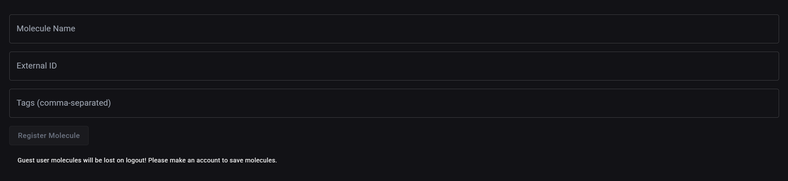

# 🔍 Features

---

## 🔐 Authentication

MolBase provides a secure and seamless authentication system with support for:

??? o-auth "OAuth login via Google, Microsoft, Facebook, or Github"
    

        <video 
            src="./../media/mp4/login_modal.mp4" 
            autoplay 
            muted 
            playsinline 
            loop 
            style="max-width: 400px; border-radius: 12px;">
        </video>
    

??? e-mail-registration "Email-based registration"  
    

        <video 
            src="./../media/mp4/email_signup.mp4" 
            autoplay 
            muted 
            playsinline 
            loop 
            style="max-width: 400px; border-radius: 12px;">
        </video>
    

??? e-mail-verification "Email verification for user to be activated "  
    

        <video 
            src="./../media/mp4/email_verification.mp4" 
            autoplay 
            muted 
            playsinline 
            loop 
            style="max-width: 400px; border-radius: 12px;">
        </video>
    

??? user-login "Username based login"  
    

        <video 
            src="./../media/mp4/username_login.mp4" 
            autoplay 
            muted 
            playsinline 
            loop 
            style="max-width: 400px; border-radius: 12px;">
        </video>
    

??? qr-code "Two-Factor Authentication (2FA) for enhanced security (optional)"  
    

        <video 
            src="./../media/mp4/2fa_setup.mp4" 
            autoplay 
            muted 
            playsinline 
            loop 
            style="max-width: 400px; border-radius: 12px;">
        </video>
    

??? e-mail-verification "Email-based password reset"  
    

        <video 
            src="./../media/mp4/forgot_pass.mp4" 
            autoplay 
            muted 
            playsinline 
            loop 
            style="max-width: 400px; border-radius: 12px;">
        </video>
    

---

## 👤 Guest User Functionality

MolBase supports guest login for users who wish to explore without creating an account:

- Temporary session access
- No data persistence — session data is discarded upon logout
- Automatic cleanup — molecules created during a guest session are deleted on logout

---

## 🏠 Main Application View

Upon logging in, users are directed to the Molecule Search Dashboard, which provides a streamlined and interactive environment for molecular discovery.

??? sun-moon "Sleek ultra-dark mode enabled by default, with an optional dark-blue theme for visual flexibility"
    

        <video 
            src="./../media/mp4/dark_mode_demo.mp4" 
            autoplay 
            muted 
            playsinline 
            loop 
            style="max-width: 100%; border-radius: 12px;">
        </video>
    

??? notebook-pen "Integrated Ketcher sketcher for structure-based searches"
    

        <video 
            src="./../media/mp4/ketcher_demo.mp4" 
            autoplay 
            muted 
            playsinline 
            loop 
            style="max-width: 100%; border-radius: 12px;">
        </video>
    

??? search "Support for **Exact**, **Substructure**, **Similarity** and **AI-powered GNN Similarity** search modes"
    

        <video 
            src="./../media/mp4/search_options.mp4" 
            autoplay 
            muted 
            playsinline 
            loop 
            style="max-width: 100%; border-radius: 12px;">
        </video>
    

??? loader "Load-on-demand molecule results with responsive, real-time filtering"
    

        <video 
            src="./../media/mp4/loading_molecules.mp4" 
            autoplay 
            muted 
            playsinline 
            loop 
            style="max-width: 100%; border-radius: 12px;">
        </video>
    

---

## 🔎 Molecule Search

??? search "Exact Match Search using Canonical SMILES for uniqueness"
    

        <video 
            src="./../media/mp4/exact_match_demo.mp4" 
            autoplay 
            muted 
            playsinline 
            loop 
            style="max-width: 100%; border-radius: 12px;">
        </video>
    

??? binoculars "**Substructure Search** using RDKit and PostgreSQL"
    

        <video 
            src="./../media/mp4/substructure_demo.mp4" 
            autoplay 
            muted 
            playsinline 
            loop 
            style="max-width: 100%; border-radius: 12px;">
        </video>
    

??? search-code "**Similarity Search** using vector embeddings and pgvector"
    

        <video 
            src="./../media/mp4/sim_search_demo.mp4" 
            autoplay 
            muted 
            playsinline 
            loop 
            style="max-width: 100%; border-radius: 12px;">
        </video>
    

??? package-search "Filtering based on current view or entire dataset"
    

        <video 
            src="./../media/mp4/view_serach_demo.mp4" 
            autoplay 
            muted 
            playsinline 
            loop 
            style="max-width: 100%; border-radius: 12px;">
        </video>
    

??? move-horizontal "Resizable columns for better view of search details"
    

        <video 
            src="./../media/mp4/resize_columns.mp4" 
            autoplay 
            muted 
            playsinline 
            loop 
            style="max-width: 100%; border-radius: 12px;">
        </video>
    

---

## 🎨 Molecule Visualization

??? eye "Each result displays a live SVG rendering using OpenChemLib"
    

        <video 
            src="./../media/mp4/live_svg_render.mp4" 
            autoplay 
            muted 
            playsinline 
            loop 
            style="max-width: 100%; border-radius: 12px;">
        </video>
    

??? view "Click to view metadata, SMILES, or copy structure"
    

        <video 
            src="./../media/mp4/view_metadata.mp4" 
            autoplay 
            muted 
            playsinline 
            loop 
            style="max-width: 100%; border-radius: 12px;">
        </video>
    

??? wrench "Tooltips for long names and tag displays"
    

        <video 
            src="./../media/mp4/tooltips.mp4" 
            autoplay 
            muted 
            playsinline 
            loop 
            style="max-width: 100%; border-radius: 12px;">
        </video>
    

---

## 🧠 AI-Driven Similarity

- Powered by a Graph Neural Network (GNN) trained using SimCLR-style contrastive learning
- Embeddings stored in `pgvector` for lightning-fast comparisons
- Includes top-k similarity ranking vs. anchor molecule
- Ongoing improvements are being made to enhance the precision and reliability of AI-based search results

---

## 🧪 Molecule Registration

- Users can submit and register their own molecules into the central database
- Molecular properties are auto-generated using Python’s RDKit backend during registration
- Each user retains full control over their own molecules with the ability to edit or delete entries
- Any edits to the molecule structure trigger automatic recomputation of RDKit-based descriptors to ensure data accuracy

---

## 📦 Dataset

- 6M+ molecules imported from PubChem
- Filterable by tags, source, name, weight, user or structure

---
